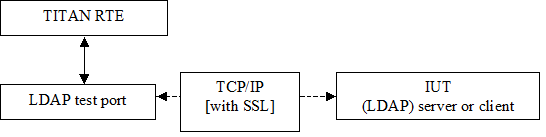

= LDAPasp_RFC4511 Test Port for TTCN-3 Toolset with TITAN, Function Specification
:author: Szabolcs Béres
:revnumber: 155 17-CNL 113 513, Rev. B
:revdate: 2012-10-12
:toc:

== How to Read This Document

This is the Function Specification for the LDAPasp_RFC4511 test port. The LDAPasp_RFC4511 test port is developed for the TTCN-3 Toolset.

== Scope

The purpose of this document is to specify the functionality of the LDAPasp_RFC4511 test port. The document is primarily addressed to the end users of the product. Basic knowledge of TTCN-3, TITAN TTCN-3 Test Executor, LDAP, and SSL protocols is valuable when reading this document.

This document is based on specifications of Lightweight Directory Access Protocol defined by https://www.ietf.org/rfc/rfc4511.txt[RFC 4511] (see <<_4, [4]>>).

= General

The LDAPasp_RFC4511 Test Port makes it possible to execute test suites towards an IUT. The test port allows sending and receiving LDAP messages between the test suite and IUT via a TCP/IP or SSL. It can be used with or without connection ASPs. If used with connection ASPs, the Test Port indicates socket events with sending the appropriate ASP to the test suite, and the connect and listen operations can be initiated from the test suite (for more details see <<_2, [2]>>). Without connection ASPs, in client mode only one, in server mode more than one connection can be handled.

The communication between the LDAPasp_RFC4511 test port and the TITAN RTE is done by using the API functions described in <<_3, [3]>>. The LDAP protocol messages are then transferred by the Test Port to the IUT through a network connection.

See the overview of the system below:

= Function Specification

== Implementation

=== Environment

The LDAPasp_RFC4511 test port makes use of the services provided by the UNIX socket interface. When connecting to an SSL enabled IUT, the connection is secured with the OpenSSL toolkit based on configuration data. The test port can work as a client or as a server.

== Configuration

The configuration of the LDAP test port is done by the TITAN RTE configuration file. The description of the specific parameters can be found in the User’s Guide (<<_2, [2]>>).

== Start Procedure

=== Connection ASPs

Used with connection ASPs, the connect and listen operations can be initiated from the test suite using the `ASP_LDAP_connect` and `ASP_LDAP_listen` ASPs accordingly (for more details, see <<_2, [2]>>)

=== Server Mode

Upon the TTCN-3 `map()` operation the server creates a TCP socket and starts listening on it. Depending on the transport channel specified in the runtime configuration file, it will accept either TCP or SSL connections. The listening host name and port must be given in the RTE configuration file.

=== Client Mode

When the Test Port is mapped by TITAN RTE, the client creates a TCP socket and tries to connect to the server. If the transport channel is SSL, the client starts an SSL handshake once the TCP connection is established to the server. If the SSL handshake is successful, the SSL connection is established and the map operation is finished. The host name and port to connect to must be given in the RTE configuration file.

The SSL handshake may fail due to several reasons (for example, no shared ciphers, verification failure, etc.). For possible causes study <<_5, [5]>>.

[[sending-receiving-ldap-messages]]
== Sending/Receiving LDAP Messages

[[deviation-from-the-standard-ldap-asn-1-type-definition-module]]
=== Deviation from the Standard LDAP ASN.1 Type Definition Module

==== `LDAPString`, `LDAPOID`

Definition in <<_4, [4]>>:

[source]
----
LDAPString ::= OCTET STRING

LDAPOID ::= OCTET STRING
----

Definition in LDAP test port type definition module:

[source]
----
LDAPString ::= [UNIVERSAL 4] UTF8String

LDAPOID ::= [UNIVERSAL 4] UTF8String
----

Reason for deviation: the variables of type LDAPString and LDAPOID shall contain UTF-8 encoded character string. With this deviation the user gets rid of the need for UTF-8 encoding character strings. By applying a `[UNIVERSAL 4]` tag the ASN.1 tag of these types is the same as of OCTET STRING.

==== Resolving TTCN-3 Name Clashes

Some names in <<_4, [4]>> are reserved words in TTCN-3. The following names were changed in order to allow usage in TTCN-3:

[cols=2*,options=header]
|===

|Standard name
|Changed name

|`and`
|`andField`

|`or`
|`orField`

|`not`
|`notField`

|`any`
|`anyField`

|`type`
|`typeField`

|`replace`
|`replaceValue`

|`delete`
|`deleteValue`

|`add`
|`addValue`
|===

[[ldap-messages-sent-received-by-the-test-port-to-the-ttcn-3-test-suite]]
=== LDAP Messages Sent/Received by the Test Port to the TTCN-3 Test Suite

The LDAP test port is able to send/receive the `ASP_LDAP_msg` structure. This structure contains an optional client identifier and an LDAP message. The client identifier (which is an integer), in case of handling more than one connection, is used to distinguish the connections (for further details see <<_2, [2]>>).

== Logging

The type of information that will be logged can be categorized into two groups. The first one consists of information that shows the flow of the internal execution of the test port, for example, important events, which function that is currently executing etc. The second group deals with presenting valuable data, for example, presenting the content of a PDU. The logging printouts will be directed to the RTE log file. The user is able to decide whether logging is to take place or not by setting appropriate configuration data, see <<_3, [3]>>.

== Error Handling

Erroneous behavior detected during runtime is directed into the RTE log file. The following two types of messages are taken care of:

* Errors - information about errors detected is provided. If an error occurs the execution of the test case will stop immediately. The test ports will be unmapped.
* Warnings - information about warnings detected is provided. The execution continues after the warning is shown.

== Closing Down

The connection can be shut down performing the `unmap()` operation on the port.

== SSL Functionality

The test port can use SSL or TCP as the transport channel. The same version of OpenSSL library must be used as in TITAN.

The protocols SSLv2, SSLv3 and TLSv1 are supported.

=== Compilation

The usage of SSL and even the compilation of the SSL related code parts are optional. This is because SSL related code parts cannot be compiled without the OpenSSL installed.

The compilation of SSL related code parts can be disabled by not defining the `AS_USE_SSL` macro in the _Makefile_ during the compilation. If the macro is defined in the _Makefile_, the SSL code parts are compiled to the executable test code. The usage of the SSL then can be enabled/disabled in the runtime configuration file, see <<_2, [2]>>. Naturally the test port parameter will be ignored if the `AS_USE_SSL` macro is not defined during compilation. For information about the compilation see <<_2, [2]>>.

=== Authentication

The test port provides both server side and client side authentication. When authenticating the other side, a certificate is requested and the own trusted certificate authorities’ list is sent. The received certificate is verified whether it is a valid certificate or not (the public and private keys are matching). No further authentication is performed (for example, whether hostname is present in the certificate). The verification can be enabled/disabled in the runtime configuration file, see <<_2, [2]>>.

In server mode the test port will always send its certificate and trusted certificate authorities’ list to its clients. If verification is enabled in the runtime configuration file, the server will request for a client’s certificate. In this case, if the client does not send a valid certificate or does not send a certificate at all, the connection will be refused. If the verification is disabled, the connection will never be refused due to verification failure.

In client mode the test port will send its certificate to the server on the server’s request. If verification is enabled in the runtime configuration file, the client will send its own trusted certificate authorities’ list to the server and will verify the server’s certificate as well. If the server’s certificate is not valid, the SSL connection will not be established. If verification is disabled, the connection will never be refused due to verification failure.

The own certificate(s), the own private key file, the optional password protecting the own private key file and the trusted certificate authorities’ list file can be specified in the runtime configuration file, see <<_2, [2]>>.

The test port will check the consistency between its own private key and the public key (based on the own certificate) automatically. If the check fails, a warning is issued and execution continues.

=== Other Features

Both client and server support SSLv2, SSLv3 and TLSv1, however, no restriction is possible to use only a subset of these. The used protocol will be selected during the SSL handshake automatically.

The usage of SSL session resumption can be enabled/disabled in the runtime configuration file, see <<_2, [2]>>.

The allowed ciphering suites can be restricted in the runtime configuration file, see <<_2, [2]>>.

The SSL rehandshaking requests are accepted and processed, however rehandshaking cannot be initiated from the test port.

=== Limitations

* No restriction is possible on the used protocols (for example, use only SSLv2), it is determined during SSL handshake between the peers.
* SSL rehandshaking cannot be initiated from the test port.
* The own certificate file(s), the own private key file and the trusted certificate authorities’ list file must be in PEM format. Other formats are not supported.

[[deviations-from-ldapmsg-cnl113385-test-port]]
== Deviations from LDAPmsg_CNL113385 Test Port

LDAPmsg_CNL113385 Test Port is based on https://www.ietf.org/rfc/rfc2251.txt[RFC2251], while this Test Port is based on https://www.ietf.org/rfc/rfc4511.txt[RFC4511]. The differences between the two standards can be found in Appendix C. of https://www.ietf.org/rfc/rfc4511.txt[RFC4511]. In this section of this document I describe the main changes in the test port interface.

=== Used Message Types

In the LDAPmsg_CNL113385 Test Port, in case of server mode operation the `ASP_LDAP_server` ASP, in case of client mode operation the LDAPMessage type was used to send and receive LDAP messages. In this test port, in both case, the `ASP_LDAP_msg` ASP is used (see <<_2, [2]>>).

=== Removed the Binary Option from AttributeDescription

From RFC4511 the binary option was removed. This affected the AttributeValue and AssertionValue structures:

Definitions in LDAPmsg_CNL113385 Test Port:

[source]
----
AttributeValue ::= CHOICE {
               string UTF8String,
               binary OCTET STRING}

AssertionValue ::= CHOICE {
               string UTF8String,
               binary OCTET STRING}
----

Definitions in this Test Port:

[source]
----
AttributeValue ::= OCTET STRING

AssertionValue ::= OCTET STRING
----

=== Changed Field Type in SubstringFilter

Definition in LDAPmsg_CNL113385 Test Port:

[source]
----
SubstringFilter ::= SEQUENCE {
                typeField AttributeDescription,
                -- at least one must be present
                substrings SEQUENCE OF CHOICE {
                            initial  [0] LDAPString,
                            anyField [1] LDAPString,
                            final    [2] LDAPString }}
----

Definition in this Test Port:

[source]
----
SubstringFilter ::= SEQUENCE {
                typeField AttributeDescription,
                -- at least one must be present
                substrings SEQUENCE OF CHOICE {
                            initial  [0] AssertionValue,
                            anyField [1] AssertionValue,
                            final    [2] AssertionValue }}
----

== LDIF Support

The support contains 3 functions:

* `f_ImportLDIF` - Imports data from an LDIF file.
* `f_PopulateLDAPServer` - Populates LDAP servers.
* `f_DepopulateLDAPServer` - Depopulates LDAP servers.

= Terminology

* *Sockets:* +
The socket is a method for communication between a client program and a server program in a network. A socket is defined as "the endpoint in a connection." Sockets are created and used with a set of programming requests or "function calls" sometimes called the sockets application programming interface (API). The most common socket API is the Berkeley UNIX C language interface for sockets. Sockets can also be used for communication between processes within the same computer.

* *OpenSSL:* +
The OpenSSL Project is a collaborative effort to develop a robust, commercial-grade, full-featured, and open source toolkit implementing the Secure Sockets Layer (SSL v2/v3) and Transport Layer Security (TLS v1) protocols as well as a full-strength general purpose cryptography library. For more information on the OpenSSL project see <<_5, [5]>>.

= Abbreviations

IP:: Internet Protocol

IUT:: Implementation Under Test

LDAP:: Lightweight Directory Access Protocol

LDIF:: LDAP Data Interchange Format

RTE:: RunTime Environment

TCP:: Transmission Control Protocol

TTCN-3:: Testing and Test Control Notation version 3

SSL:: Secure Sockets Layer

= References

[[_1]]
[1] ETSI ES 201 873-1 v.3.1.1 (06/2005) +
The Testing and Test Control Notation version 3. Part 1: Core Language

[[_2]]
[2] LDAPasp_RFC4511 Test Port for TTCN-3 Toolset with TITAN, User Guide

[[_3]]
[3] Programmer’s Technical Reference for the TITAN TTCN-3 Test Executor

[[_4]]
[4] https://www.ietf.org/rfc/rfc4511.txt[RFC 4511] +
Lightweight Directory Access Protocolhttp://ietf.org/rfc/rfc4511.txt

[[_5]]
[5] OpenSSL toolkit +
http://www.openssl.org

[[_6]]
[6] http://ietf.org/rfc/rfc2849.txt[RFC 2849] +
The LDAP Data Interchange Format (LDIF) – Technical Specification
